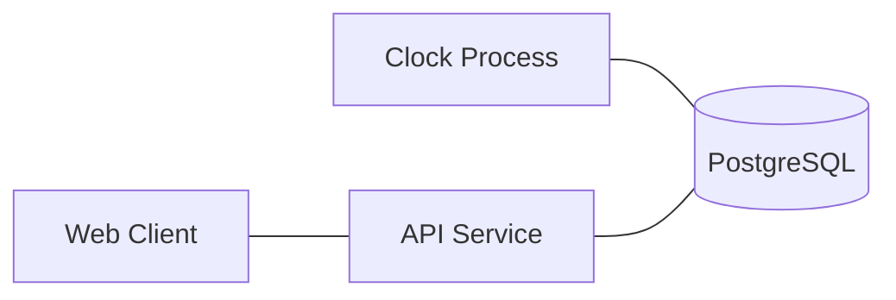

# Mornington

Created by [Roger Jungemann](https://phasor.space)

## What is Mornington?

Mornington is a subway simulator.

Put another way, Mornington is a sort of simulation, or [zero-player game](https://en.wikipedia.org/wiki/Zero-player_game), in the vein of [Blaseball](https://en.wikipedia.org/wiki/Blaseball). Instead of simulating games of baseball, Mornington simulates games of [Mornington Crescent](https://en.wikipedia.org/wiki/Mornington_Crescent_(game)).


## Setup

Have NodeJS and `yarn` installed on your machine, as well as Postgres.

Clone the `mornington` repo. `cd mornington`

```sh
# Setup backend prerequisites
pushd api
yarn install

# Create the database
yarn db:drop
yarn db:create
yarn db:sync
yarn db:seed
# Or...
yarn db:all

# Import an SVG map
yarn game:import --file=../assets/map1.svg
yarn game:import --file=../assets/map2.svg

popd

# Setup frontend prerequisites
pushd app
yarn install
popd

# Start the API service
# In another terminal,
cd api
yarn api:start

# Start the clock, which runs the simulation
# In another terminal,
cd api
yarn clock:start
# Or, to just run once:
yarn clock:tick

# Start the frontend app
# In another terminal,
cd app
yarn dev
```

## Structure



### Clock

The clock runs every ten seconds currently, meaning a tick of the simulation happens every ten seconds.

Every ten seconds, the clock iterates through each game.

For each game:

* A transaction is opened
* Trains and agents are updated in the database
* The game state is precomputed and stored in a "game turn" table

Future enhancements include:

* It would be straightforward to enqueue a job per-game per-tick. This would allow each game to be processed roughly in parallel.
* All game objects are scoped to a specific game ID, which would make splitting games across databases in some way is a possibility.

### API Service

The API service is an Express app which can pull latest game state (precalculated and stored in a "game turn" row in the DB) and serve it to the user.

This endpoint is designed for frequent access.

Future enhancements include:

* Use a dedicated caching solution for storing state for a given game
* Use websockets to notify a user when a turn has taken place (notification can be sent from the clock after update)

### Frontend App

A NextJS app which renders games using React and SVG. Designed to be fast and lightweight.

## Quick Codebase Tour

* `app/`
  * `package.json` lists the dependencies as well as the scripts that can be run
  * `src/page.tsx` is the primary page that shows the game board
  * `src/gameboard.tsx` is the component that renders game state
  * `src/graph.tsx` renders the game view using SVG
* `api/`
  * `package.json` lists the dependencies as well as the scripts that can be run
  * `src/index.ts` is the primary script for the API service
  * `src/clock.ts` is the primary script for the Clock

## Deployment

### Heroku

Once Heroku is setup,

```sh
# Deploy backend
git subtree push --prefix api backend main
# Or, to force-push (preferred for CI)
git push backend `git subtree split --prefix api main`:main --force

# Sync and seed the DB
heroku run -a mornington-backend yarn db:sync
heroku run -a mornington-backend yarn db:seed

# Get the logs for the API and clock process
heroku logs --tail -a mornington-backend

# Dump and load the DB
heroku pg:backups:capture -a $api
heroku pg:backups:download -a $api

# Deploy frontend
git subtree push --prefix app frontend main
# Or, to force-push (preferred for CI)
git push frontend `git subtree split --prefix app main`:main --force
```

## Credits

Subway icon from [SVG Repo](https://www.svgrepo.com/svg/488698/subway). Generated favicon with [RealFaviconGenerator](https://realfavicongenerator.net/).
